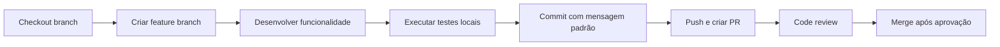

# 🎓 **Guia de Treinamento - Padrões Avila DevOps SaaS**

## 📋 **Bem-vindo ao Time!**

Este guia foi criado para ajudar novos desenvolvedores e membros da equipe a entenderem rapidamente os padrões, processos e melhores práticas da plataforma Avila DevOps SaaS.

---

## 🎯 **Objetivos do Treinamento**

Após completar este guia, você será capaz de:

- ✅ **Navegar** eficientemente pela estrutura do projeto
- ✅ **Criar** novos serviços seguindo os padrões estabelecidos
- ✅ **Contribuir** com código de qualidade consistente
- ✅ **Deployar** aplicações em ambiente de desenvolvimento
- ✅ **Debugar** problemas comuns de forma independente

---

## 🏗️ **Módulo 1: Entendendo a Arquitetura**

### **Estrutura Geral do Projeto**

```
📁 SaaS/ (Raiz do Projeto)
├── 📁 apps/                    # 🚨 SERVIÇOS PRINCIPAIS
│   ├── main-app/              # Aplicação principal Django
│   ├── clinic-management/     # Gestão de clínicas (Next.js)
│   ├── fiscal-analytics/      # Análise fiscal (Django)
│   ├── recycling-system/      # Sistema reciclagem (Django)
│   ├── landing-page/          # Página institucional (Django)
│   └── mobile/                # Aplicativo móvel (React Native)
├── 📁 infrastructure/         # 🏗️ INFRAESTRUTURA
│   ├── docker/               # Containers e Docker Compose
│   ├── kubernetes/           # Orquestração K8s
│   ├── terraform/            # Infraestrutura como código
│   └── nginx/                # Load balancer e proxy reverso
├── 📁 scripts/                # ⚙️ SCRIPTS DE AUTOMAÇÃO
│   ├── admin/                # Scripts administrativos
│   ├── setup/                # Configuração inicial
│   ├── deploy/               # Deployment automatizado
│   └── docker/               # Gestão de containers
├── 📁 shared/                 # 🔗 RECURSOS COMPARTILHADOS
│   ├── config/               # Configurações centralizadas
│   ├── utils/                # Utilitários comuns
│   └── requirements/          # Dependências padronizadas
├── 📁 docs/                   # 📚 DOCUMENTAÇÃO
│   ├── architecture/         # Arquitetura detalhada
│   ├── development/          # Guias de desenvolvimento
│   ├── deployment/           # Guias de deployment
│   ├── api/                  # Documentação das APIs
│   └── training/             # Este guia de treinamento
└── 📄 Arquivos essenciais na raiz
```

### **🏷️ Convenções de Nomenclatura**

| **Tipo** | **Convenção** | **Exemplo** | **❌ Errado** |
|----------|---------------|-------------|---------------|
| **Pastas** | kebab-case | `clinic-management` | `clinicManagement` |
| **Arquivos Python** | snake_case | `admin_panel.py` | `adminPanel.py` |
| **Classes** | PascalCase | `ClinicManager` | `clinic_manager` |
| **Variáveis** | snake_case | `user_name` | `userName` |
| **Serviços** | kebab-case | `fiscal-analytics` | `fiscalAnalytics` |

---

## 🔧 **Módulo 2: Configuração do Ambiente**

### **Pré-requisitos**

```bash
# Sistema operacional
- Windows 10/11, macOS 12+, ou Linux (Ubuntu 20.04+)

# Ferramentas necessárias
✅ Docker & Docker Compose
✅ Git
✅ Python 3.11+
✅ Node.js 18+ (para desenvolvimento frontend/mobile)
✅ PostgreSQL 15+ (para desenvolvimento local)
✅ Redis 7+ (opcional para desenvolvimento)

# IDE recomendado
✅ Visual Studio Code com extensões:
  - Python (Microsoft)
  - Django (ms-python.django)
  - Docker (ms-azuretools.vscode-docker)
  - GitLens (eamodio.gitlens)
```

### **Configuração Inicial**

```bash
# 1. Clone o repositório
git clone <repository-url>
cd aviladevops-saas

# 2. Configure variáveis de ambiente
cp .env.example .env
# Edite .env com suas configurações locais

# 3. Execute o ambiente de desenvolvimento
docker-compose -f infrastructure/docker/docker-compose.dev.yml up -d

# 4. Acesse os serviços
# - Main App: http://localhost:8000
# - Clínica: http://localhost:3000
# - Fiscal: http://localhost:8001
# - PgAdmin: http://localhost:5050
```

### **Verificação da Instalação**

```bash
# Teste básico de funcionamento
curl http://localhost:8000/health/
# Deve retornar: {"status": "healthy", ...}

# Teste de banco de dados
docker-compose -f infrastructure/docker/docker-compose.dev.yml exec db psql -U postgres -d aviladevops_dev -c "SELECT 1;"
# Deve retornar: ?column? = 1
```

---

## 🚀 **Módulo 3: Desenvolvimento Diário**

### **Fluxo de Trabalho Padrão**



### **Criando uma Nova Funcionalidade**

```bash
# 1. Criar branch para nova feature
git checkout -b feature/nova-funcionalidade

# 2. Desenvolver seguindo padrões
# - Usar estrutura de pastas correta
# - Seguir convenções de nomenclatura
# - Adicionar testes
# - Atualizar documentação

# 3. Executar testes locais
python manage.py test

# 4. Commit seguindo padrão
git add .
git commit -m "feat: adiciona nova funcionalidade

- Implementa modelo X com validações
- Cria API endpoints para CRUD
- Adiciona testes unitários
- Atualiza documentação

Closes #123"

# 5. Push e criar Pull Request
git push origin feature/nova-funcionalidade
```

### **Estrutura de Commits**

```bash
# ✅ Correto
feat: adiciona sistema de agendamentos
fix: corrige validação de CPF
docs: atualiza documentação da API
refactor: otimiza consultas de banco
test: adiciona testes para modelo X
chore: atualiza dependências

# ❌ Incorreto
"update stuff"
"fix bug"
"add feature"
```

---

## 🛠️ **Módulo 4: Desenvolvimento Backend (Django)**

### **Estrutura Padrão de Serviço Django**

```
📁 meu-servico/
├── 📄 README.md                    # Documentação específica
├── 📄 Dockerfile                   # Container da aplicação
├── 📄 requirements.txt             # Dependências Python
├── 📄 docker-compose.yml           # Ambiente local
├── 📄 .env.example                 # Template de configuração
├── 📁 src/                         # Código fonte
│   └── 📁 meu_servico/             # Projeto Django
│       ├── 📄 settings.py          # Configurações específicas
│       ├── 📄 urls.py              # Rotas principais
│       ├── 📄 wsgi.py              # WSGI configuration
│       └── 📁 apps/                # Aplicações Django
│           ├── 📁 core/            # App core (health check)
│           └── 📁 api/             # APIs REST
└── 📁 docs/                        # Documentação técnica
```

### **Criando um Novo Serviço Django**

```bash
# 1. Usar template padrão
cp -r templates/service-template/ apps/meu-novo-servico

# 2. Personalizar templates
# - Substituir {SERVICE_NAME} por "Meu Novo Serviço"
# - Ajustar portas, configurações específicas
# - Adicionar funcionalidades específicas

# 3. Instalar e configurar
cd apps/meu-novo-servico
cp .env.example .env
# Editar .env com configurações específicas

# 4. Executar migrações
docker-compose -f docker-compose.yml exec meu-novo-servico python manage.py migrate

# 5. Testar serviço
curl http://localhost:PORTA/health/
```

### **Padrões de Código Django**

```python
# ✅ Modelo bem estruturado
class Cliente(TenantModelBase):
    nome = models.CharField(max_length=255)
    email = models.EmailField(unique=True)
    telefone = models.CharField(max_length=20, blank=True)
    criado_em = models.DateTimeField(auto_now_add=True)
    atualizado_em = models.DateTimeField(auto_now=True)

    class Meta:
        ordering = ['nome']
        indexes = [
            models.Index(fields=['email']),
            models.Index(fields=['telefone']),
        ]

    def __str__(self):
        return self.nome

# ✅ Serializer com validações
class ClienteSerializer(serializers.ModelSerializer):
    class Meta:
        model = Cliente
        fields = ['id', 'nome', 'email', 'telefone', 'criado_em']
        read_only_fields = ['id', 'criado_em']

    def validate_email(self, value):
        if Cliente.objects.filter(email=value).exists():
            raise serializers.ValidationError("Email já existe.")
        return value

# ✅ ViewSet com filtros e paginação
class ClienteViewSet(viewsets.ModelViewSet):
    queryset = Cliente.objects.all()
    serializer_class = ClienteSerializer
    permission_classes = [IsAuthenticated]
    filter_backends = [DjangoFilterBackend]
    filterset_fields = ['nome', 'email']
    pagination_class = PageNumberPagination
```

---

## 🎨 **Módulo 5: Desenvolvimento Frontend (Next.js)**

### **Estrutura Padrão Next.js**

```
📁 meu-servico-frontend/
├── 📄 README.md                    # Documentação
├── 📄 package.json                 # Dependências Node.js
├── 📄 next.config.js               # Configuração Next.js
├── 📄 tailwind.config.js           # Configuração Tailwind
├── 📁 pages/                       # Páginas Next.js
│   ├── api/                        # API Routes
│   ├── _app.tsx                    # Configuração global
│   └── index.tsx                   # Página inicial
├── 📁 components/                  # Componentes React
│   ├── Layout.tsx                  # Layout principal
│   ├── Header.tsx                  # Cabeçalho
│   └── ui/                         # Componentes básicos
├── 📁 styles/                      # Estilos globais
└── 📁 public/                      # Assets estáticos
```

### **Criando Componentes React**

```typescript
// components/ExemploCard.tsx
import React from 'react';
import { Card, CardContent, CardHeader, CardTitle } from '@/components/ui/card';

interface ExemploCardProps {
  titulo: string;
  descricao: string;
  onClick?: () => void;
}

export const ExemploCard: React.FC<ExemploCardProps> = ({
  titulo,
  descricao,
  onClick
}) => {
  return (
    <Card className="hover:shadow-lg transition-shadow cursor-pointer" onClick={onClick}>
      <CardHeader>
        <CardTitle>{titulo}</CardTitle>
      </CardHeader>
      <CardContent>
        <p className="text-muted-foreground">{descricao}</p>
      </CardContent>
    </Card>
  );
};
```

### **Consumindo APIs**

```typescript
// services/api.ts
import { Cliente } from '@/types';

const API_BASE = process.env.NEXT_PUBLIC_API_URL;

export class ApiService {
  private static async request(endpoint: string, options: RequestInit = {}) {
    const token = localStorage.getItem('token');

    const response = await fetch(`${API_BASE}${endpoint}`, {
      headers: {
        'Content-Type': 'application/json',
        'Authorization': `Bearer ${token}`,
        ...options.headers,
      },
      ...options,
    });

    if (!response.ok) {
      throw new Error(`API Error: ${response.status}`);
    }

    return response.json();
  }

  static async getClientes() {
    return this.request('/clientes/');
  }

  static async createCliente(clienteData: Partial<Cliente>) {
    return this.request('/clientes/', {
      method: 'POST',
      body: JSON.stringify(clienteData),
    });
  }
}
```

---

## 📱 **Módulo 6: Desenvolvimento Mobile (React Native)**

### **Estrutura Padrão React Native**

```
📁 mobile/
├── 📄 package.json                 # Dependências
├── 📄 App.tsx                      # Ponto de entrada
├── 📁 src/                         # Código fonte
│   ├── 📁 components/              # Componentes React Native
│   ├── 📁 screens/                 # Telas da aplicação
│   ├── 📁 services/                # Serviços e APIs
│   ├── 📁 store/                   # Redux Toolkit
│   ├── 📁 types/                   # Definições TypeScript
│   └── 📁 utils/                   # Utilitários
├── 📁 assets/                      # Imagens e fontes
└── 📄 app.json                     # Configuração Expo
```

### **Criando Telas Mobile**

```typescript
// src/screens/HomeScreen.tsx
import React from 'react';
import { View, Text, StyleSheet } from 'react-native';
import { Button } from 'react-native-elements';

export const HomeScreen: React.FC = () => {
  return (
    <View style={styles.container}>
      <Text style={styles.title}>Avila DevOps SaaS</Text>
      <Text style={styles.subtitle}>Aplicativo Mobile</Text>

      <Button
        title="Ver Clientes"
        onPress={() => navigation.navigate('Clientes')}
        containerStyle={styles.button}
      />
    </View>
  );
};

const styles = StyleSheet.create({
  container: {
    flex: 1,
    justifyContent: 'center',
    alignItems: 'center',
    padding: 16,
  },
  title: {
    fontSize: 24,
    fontWeight: 'bold',
    marginBottom: 8,
  },
  subtitle: {
    fontSize: 16,
    color: '#666',
    marginBottom: 24,
  },
  button: {
    width: '100%',
    marginVertical: 8,
  },
});
```

---

## 🧪 **Módulo 7: Testes e Qualidade**

### **Tipos de Testes**

```python
# ✅ Testes Unitários (models, utils)
def test_cliente_creation(self):
    cliente = Cliente.objects.create(nome="Teste")
    self.assertEqual(cliente.nome, "Teste")

# ✅ Testes de API (endpoints)
def test_create_cliente_api(self):
    response = self.client.post('/api/clientes/', {
        'nome': 'Cliente API',
        'email': 'api@teste.com'
    })
    self.assertEqual(response.status_code, 201)

# ✅ Testes de Integração (fluxos completos)
def test_complete_workflow(self):
    # Criar cliente -> Fazer pedido -> Verificar resultado
    pass
```

### **Executando Testes**

```bash
# Backend Django
python manage.py test                    # Todos os testes
python manage.py test apps.api          # Testes específicos
python manage.py test --coverage        # Com cobertura

# Frontend Next.js
npm run test                           # Testes unitários
npm run test:e2e                       # Testes end-to-end

# Mobile React Native
npm run test                           # Testes unitários
npx detox test                         # Testes E2E
```

---

## 🚀 **Módulo 8: Deployment e Produção**

### **Ambientes Disponíveis**

| **Ambiente** | **URL** | **Propósito** |
|---------------|---------|---------------|
| **Desenvolvimento** | `localhost` | Desenvolvimento diário |
| **Homologação** | `staging.aviladevops.com.br` | Testes antes produção |
| **Produção** | `aviladevops.com.br` | Cliente final |

### **Processo de Deployment**

```bash
# 1. Testes locais
python manage.py test

# 2. Deploy para homologação
git checkout develop
git pull origin develop
kubectl apply -f infrastructure/kubernetes/staging/

# 3. Testes em homologação
# - Verificar funcionalidades críticas
# - Testar integração entre serviços
# - Validar performance

# 4. Deploy para produção (após aprovação)
git checkout main
git pull origin main
kubectl apply -f infrastructure/kubernetes/production/
```

### **Monitoramento**

```bash
# Health checks
curl https://aviladevops.com.br/health/
curl https://api.aviladevops.com.br/health/

# Logs
kubectl logs -f deployment/aviladevops-main-app

# Métricas
# Acesse Grafana em https://monitoring.aviladevops.com.br
```

---

## 🔒 **Módulo 9: Segurança e Boas Práticas**

### **Segurança Obrigatória**

```python
# ✅ Headers de segurança
SECURE_SSL_REDIRECT = True
SESSION_COOKIE_SECURE = True
CSRF_COOKIE_SECURE = True
SECURE_HSTS_SECONDS = 31536000

# ✅ Validação de dados
def validate_cpf(value):
    # Implementar validação completa
    pass

# ✅ Rate limiting
REST_FRAMEWORK = {
    'DEFAULT_THROTTLE_RATES': {
        'anon': '100/hour',
        'user': '1000/hour'
    }
}
```

### **Boas Práticas de Código**

```python
# ✅ Correto
def get_user_appointments(user_id: int) -> List[Appointment]:
    """Get all appointments for a user."""
    return Appointment.objects.filter(user_id=user_id)

# ❌ Incorreto
def get_appts(uid):
    return Appointment.objects.filter(user_id=uid)

# ✅ Correto
logger.info("User created appointment", extra={
    'user_id': user.id,
    'appointment_id': appointment.id
})

# ❌ Incorreto
print("User created appointment")
```

---

## 📚 **Módulo 10: Recursos e Suporte**

### **Documentação Essencial**

| **Documento** | **Localização** | **Quando Usar** |
|---------------|-----------------|------------------|
| **Arquitetura** | `docs/architecture/README.md` | Entender sistema |
| **Desenvolvimento** | `docs/development/README.md` | Guias técnicos |
| **APIs** | `docs/api/README.md` | Integração |
| **Deployment** | `docs/deployment/README.md` | Produção |
| **Este Guia** | `docs/training/README.md` | Onboarding |

### **Canais de Suporte**

| **Tipo** | **Canal** | **SLA** |
|----------|-----------|---------|
| **🐛 Bugs Críticos** | GitHub Issues (P0) | < 2 horas |
| **💡 Features** | GitHub Discussions | < 1 dia |
| **❓ Dúvidas** | dev@aviladevops.com.br | < 4 horas |
| **📚 Documentação** | docs.aviladevops.com.br | - |

### **Comandos Rápidos**

```bash
# Desenvolvimento
docker-compose -f infrastructure/docker/docker-compose.dev.yml up -d

# Testes
python manage.py test

# Deploy homologação
kubectl apply -f infrastructure/kubernetes/staging/

# Ver logs
kubectl logs -f deployment/aviladevops-main-app

# Health check
curl http://localhost:8000/health/
```

---

## 🎓 **Avaliação e Certificação**

### **Checklist de Competências**

Após completar o treinamento, você deve conseguir:

- [ ] **Navegar** pela estrutura do projeto sem ajuda
- [ ] **Criar** um novo serviço seguindo templates
- [ ] **Contribuir** com código seguindo padrões
- [ ] **Debugar** problemas comuns de forma independente
- [ ] **Deployar** serviços em ambiente de desenvolvimento
- [ ] **Escrever** testes automatizados
- [ ] **Seguir** processos de code review

### **Próximos Passos**

1. **Prática**: Desenvolva uma pequena funcionalidade seguindo os padrões
2. **Mentoria**: Peça feedback de desenvolvedores seniores
3. **Contribuição**: Abra seu primeiro Pull Request
4. **Especialização**: Foque em uma área específica (backend/frontend/mobile)

---

## 🎉 **Parabéns!**

**Você agora faz parte do time Avila DevOps SaaS!**

**🏆 Benefícios de ser parte da equipe:**
- ✅ **Cultura** de desenvolvimento profissional
- ✅ **Tecnologias** modernas e atualizadas
- ✅ **Processos** bem definidos e eficientes
- ✅ **Crescimento** pessoal e profissional
- ✅ **Impacto** em um produto inovador

**🚀 Bem-vindo ao futuro do desenvolvimento SaaS!**

---

**📞 Dúvidas? Entre em contato: dev@aviladevops.com.br**

**📚 Recursos adicionais: acesse a documentação completa em `docs/`**

**🎯 Lembre-se: "Código limpo hoje, manutenção fácil amanhã!"**
