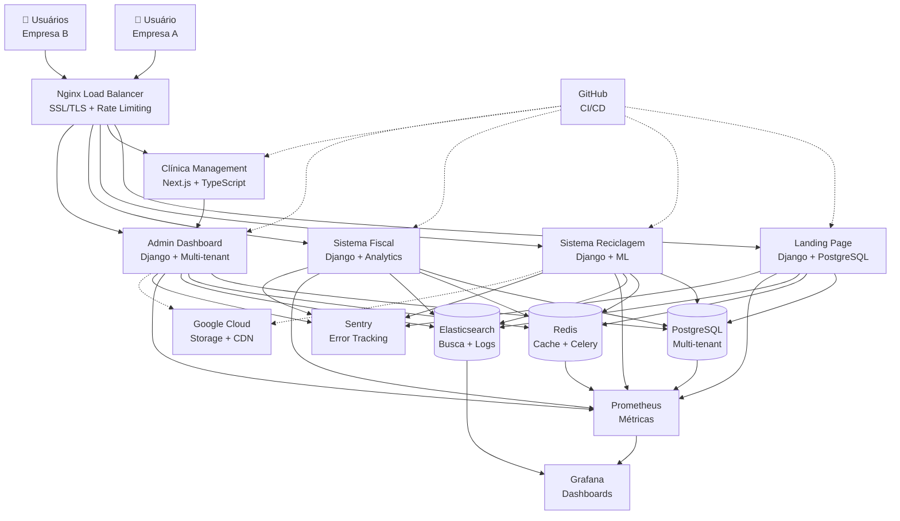
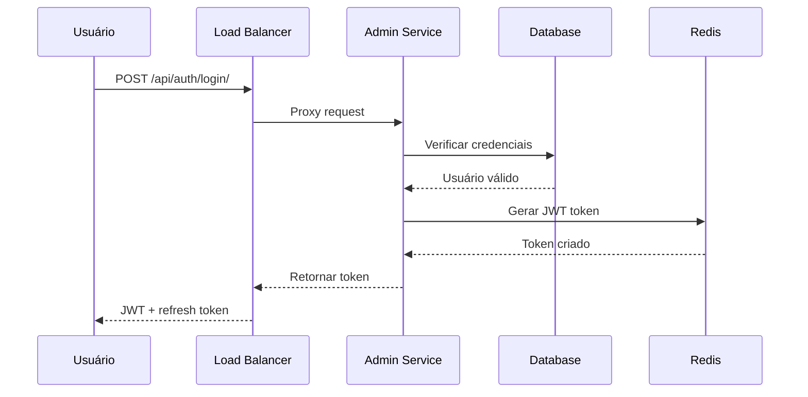
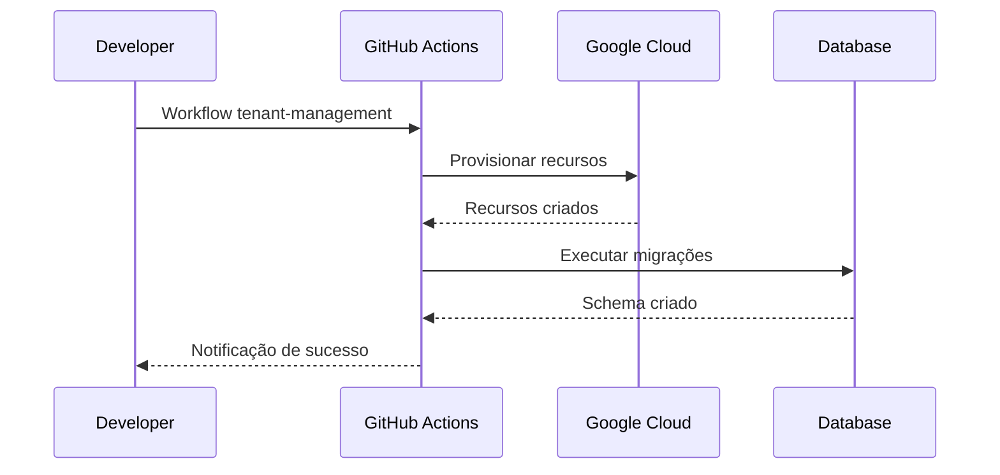

# 🏗️ Arquitetura - Ávila DevOps SaaS

## 📊 Diagrama da Arquitetura



## 🏢 Arquitetura Multi-tenant

### **Isolamento por Tenant**
Cada cliente possui ambiente completamente isolado:

```
🌐 cliente-a.aviladevops.com.br
├── 🗄️  Database Schema: tenant_a
├── 👥  Users: cliente_a_*
├── 📁  Files: /media/tenant_a/
└── ⚙️  Config: settings específicas

🌐 cliente-b.aviladevops.com.br
├── 🗄️  Database Schema: tenant_b
├── 👥  Users: cliente_b_*
├── 📁  Files: /media/tenant_b/
└── ⚙️  Config: settings específicas
```

### **Camadas de Segurança**

#### **1. Network Level**
```yaml
# Firewall rules
- Source: 0.0.0.0/0 (restrito por serviço)
- Protocol: TCP
- Ports: 80, 443 (HTTPS only)
- Rate limiting: 1000 req/min per IP
```

#### **2. Application Level**
```python
# Django settings
TENANT_MODEL = 'users.Tenant'
TENANT_ID_FIELD = 'tenant_id'

# Middleware para isolamento
class TenantMiddleware:
    def __init__(self, get_response):
        self.get_response = get_response

    def __call__(self, request):
        # Identificar tenant pelo domínio
        hostname = request.get_host().split(':')[0]
        tenant = Tenant.objects.get(domain=hostname)

        # Configurar request para tenant
        request.tenant = tenant
        return self.get_response(request)
```

#### **3. Database Level**
```sql
-- Row Level Security (RLS) no PostgreSQL
ALTER TABLE services ENABLE ROW LEVEL SECURITY;

CREATE POLICY tenant_isolation ON services
    FOR ALL USING (tenant_id = current_setting('app.current_tenant'));
```

## 🚀 Fluxos de Dados

### **Fluxo de Autenticação**


### **Fluxo de Criação de Tenant**


## 📊 Monitoramento e Observabilidade

### **Métricas Coletadas**

#### **Application Metrics**
- Request count e latency por endpoint
- Error rates por serviço
- Database query performance
- Cache hit/miss ratios

#### **Infrastructure Metrics**
- CPU, memória e disco por serviço
- Network I/O e throughput
- Database connections e performance
- Redis memory usage

#### **Business Metrics**
- Usuários ativos por tenant
- Feature usage analytics
- Revenue tracking
- Support ticket metrics

### **Dashboards**

#### **📈 Application Health**
```yaml
# Prometheus Queries
uptime = time() - process_start_time_seconds
error_rate = rate(errors_total[5m]) / rate(requests_total[5m])
response_time_p95 = histogram_quantile(0.95, rate(response_time_seconds_bucket[5m]))
db_connection_pool = db_connections_active / db_connections_max
```

#### **💰 Business KPIs**
```yaml
# Métricas de negócio
active_users = sum(ga_active_users) by (tenant)
conversion_rate = sum(purchases) / sum(visits) * 100
revenue_mrr = sum(subscription_revenue) by (tenant)
support_tickets = sum(tickets_created) - sum(tickets_resolved)
```

## 🔒 Modelo de Segurança

### **Autenticação Multi-camadas**

#### **JWT + Refresh Tokens**
```python
# Configuração Django
REST_FRAMEWORK = {
    'DEFAULT_AUTHENTICATION_CLASSES': [
        'rest_framework.authentication.TokenAuthentication',
        'rest_framework_simplejwt.authentication.JWTAuthentication',
    ],
    'DEFAULT_PERMISSION_CLASSES': [
        'rest_framework.permissions.IsAuthenticated',
    ]
}
```

#### **Tenant-based Authorization**
```python
# Middleware personalizado
class TenantPermission(BasePermission):
    def has_permission(self, request, view):
        # Verificar se usuário pertence ao tenant correto
        return request.user.tenant == request.tenant
```

### **Criptografia de Dados**

#### **Dados em Repouso**
- **Banco de dados**: PostgreSQL com encryption at rest
- **Backups**: Criptografados com AES-256
- **Files**: Cloud Storage com server-side encryption

#### **Dados em Trânsito**
- **HTTPS**: TLS 1.3 obrigatório
- **API interna**: mTLS entre serviços
- **Database**: SSL/TLS para conexões

## 🚀 Estratégia de Deploy

### **Ambientes**

#### **Desenvolvimento**
- **Local**: Docker Compose com serviços individuais
- **CI**: GitHub Actions com testes automatizados
- **CDN**: Não utilizado (desenvolvimento)

#### **Staging**
- **Infra**: Kubernetes namespace separado
- **Dados**: Database schema staging
- **CDN**: Domínio staging.aviladevops.com.br

#### **Produção**
- **Infra**: Multi-region Google Cloud
- **Dados**: Database schemas isolados por tenant
- **CDN**: Global com cache inteligente

### **Estratégia de Release**

#### **Blue-Green Deployment**
```yaml
# Kubernetes deployment
strategy:
  type: RollingUpdate
  rollingUpdate:
    maxUnavailable: 1
    maxSurge: 1
```

#### **Canary Releases**
```yaml
# Traffic splitting para validação
- 90% tráfego: versão atual
- 10% tráfego: nova versão
# Monitorar métricas por 24h antes de promover
```

## 📈 Escalabilidade

### **Auto-scaling**

#### **Horizontal Pod Autoscaler**
```yaml
apiVersion: autoscaling/v2
kind: HorizontalPodAutoscaler
metadata:
  name: saas-scaler
spec:
  scaleTargetRef:
    apiVersion: apps/v1
    kind: Deployment
    name: main-app
  minReplicas: 3
  maxReplicas: 50
  metrics:
  - type: Resource
    resource:
      name: cpu
      target:
        type: Utilization
        averageUtilization: 70
```

#### **Database Scaling**
- **Read replicas**: Para consultas de leitura
- **Connection pooling**: PgBouncer para otimização
- **Sharding**: Por tenant (planejado para futuro)

### **Performance Optimization**

#### **Caching Strategy**
- **CDN**: Static assets (CSS, JS, imagens)
- **Redis**: Sessions, API responses, computed data
- **Database**: Query results e materialized views

#### **Database Optimization**
- **Indexes**: Estratégicos por tenant e consulta comum
- **Query optimization**: EXPLAIN ANALYZE para slow queries
- **Connection pooling**: Configurado para alta concorrência

## 🔧 Desenvolvimento e DevOps

### **CI/CD Pipeline**

#### **GitHub Actions Workflow**
```yaml
name: SaaS Deployment Pipeline
on:
  push:
    branches: [main, develop]
  pull_request:
    branches: [main]

jobs:
  test:
    runs-on: ubuntu-latest
    steps:
      - uses: actions/checkout@v3
      - name: Run tests
        run: make test

  deploy-staging:
    needs: test
    if: github.ref == 'refs/heads/develop'
    runs-on: ubuntu-latest
    steps:
      - name: Deploy to staging
        run: make deploy-staging

  deploy-production:
    needs: test
    if: github.ref == 'refs/heads/main'
    runs-on: ubuntu-latest
    steps:
      - name: Deploy to production
        run: make deploy-prod
```

### **Code Quality**

#### **Linting e Formatação**
```yaml
# Python
black --check .
isort --check-only .
flake8 .
mypy .

# JavaScript/TypeScript
eslint .
prettier --check .

# Docker
hadolint Dockerfile*
```

#### **Security Scanning**
```yaml
# Dependências
safety check
npm audit

# Containers
trivy image app-image:latest

# Application
zap-baseline.py -t http://localhost:8000
```

## 📚 Recursos e Links

### **Documentação Técnica**
- [🐳 Docker Docs](./docker/)
- [☸️ Kubernetes Configs](./kubernetes/)
- [🏗️ Terraform Infra](./terraform/)
- [📊 Monitoring Setup](./monitoring/)

### **Ferramentas e Serviços**
- [🔧 Django Admin](https://docs.djangoproject.com/en/stable/ref/contrib/admin/)
- [📖 Django REST Framework](https://www.django-rest-framework.org/)
- [⚛️ Next.js Docs](https://nextjs.org/docs)
- [☁️ Google Cloud](https://cloud.google.com/docs)

### **Comunidade**
- [💬 Discord Dev](https://discord.gg/avila-devops-dev)
- [🐛 GitHub Issues](https://github.com/avila-devops/saas/issues)
- [📋 GitHub Projects](https://github.com/avila-devops/saas/projects)

---

**🏗️ Arquitetura sólida para crescimento sustentável** | **Ávila DevOps**
